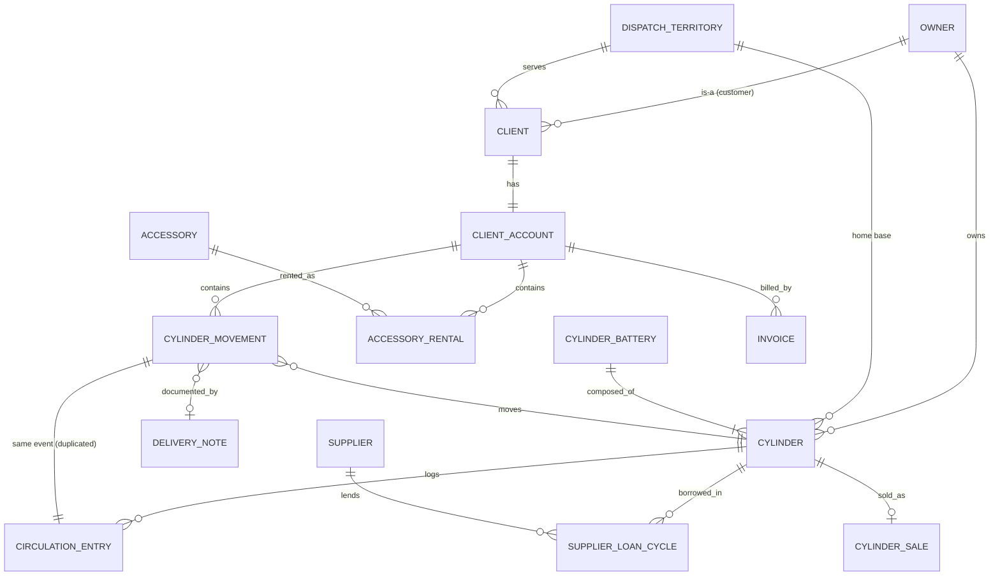

# Complete Domain Model — Gas-Cylinder Distribution & Refill Business

> Derived from reverse-engineering the three workbooks. This is the **conceptual/logical domain model the spreadsheets _imply_** — not a literal transcription of their (denormalized, duplicated, un-validated) structure. Where the spreadsheets violate a rule, I express it as the rule that _should_ hold and note the reality.
> **Legend:** `» observed` = grounded directly in cells/headers. **INFERRED** = reconstructed. `PK` = primary key, `CK` = candidate key, `FK` = foreign key.

---

## 0. Bounded Context & Ubiquitous Language

**Bounded context:** _Cylinder Custody & Circulation_ (physical asset movement + rental duration). Adjacent contexts that are **referenced but out of scope** (no data stored here): _Billing/Invoicing_ (Facturación), _Gas Filling/Production_ (Planta de fraccionamiento), _Cylinder Safety Certification_ (Prueba hidráulica).

| Term (Spanish)                         | Domain concept                                      |
| -------------------------------------- | --------------------------------------------------- |
| Cilindro / Tubo                        | **Cylinder**                                        |
| Batería / "bat"                        | **CylinderBattery** (manifold pack)                 |
| Cliente                                | **Client**                                          |
| Nuestra Propiedad (N/P)                | ownership basis = **OURS** (rental)                 |
| Su Propiedad (S/P)                     | ownership basis = **CUSTOMER** (refill)             |
| Entrega / Devolución                   | **Delivery / Return** movement                      |
| Vacío / Lleno                          | cylinder condition **Empty / Full**                 |
| Alquiler                               | **Rental** (charge by day-on-hire)                  |
| Cambio                                 | **Swap**                                            |
| Remito                                 | **DeliveryNote**                                    |
| Regulador / Adaptador / Mochila        | **Accessory**                                       |
| Vendido / Perdido / Roto / Reemplazado | terminal states **Sold / Lost / Broken / Replaced** |
| Reparto                                | **Route / DispatchTerritory**                       |

---

## 1. Entity Catalogue (overview)

| #   | Entity                                                      | Aggregate role                                        |
| --- | ----------------------------------------------------------- | ----------------------------------------------------- |
| E1  | **Cylinder** (Cilindro/Tubo)                                | Aggregate Root                                        |
| E2  | **CylinderBattery** (Batería)                               | Aggregate Root (composes Cylinders)                   |
| E3  | **Client** (Cliente)                                        | Aggregate Root                                        |
| E4  | **ClientAccount** (the ledger)                              | Entity within _Client_ aggregate                      |
| E5  | **CylinderMovement** (ledger row)                           | Entity within _ClientAccount_ aggregate               |
| E6  | **CirculationEntry** (per-cylinder log row)                 | Entity within _Cylinder_ aggregate (projection of E5) |
| E7  | **AccessoryRental**                                         | Entity within _ClientAccount_ aggregate               |
| E8  | **Accessory** (Regulador/Adaptador/Mochila)                 | Aggregate Root                                        |
| E9  | **CylinderSale** (Cilindro Vendido)                         | Aggregate Root                                        |
| E10 | **Owner / Party** (Us / Supplier / Customer)                | Aggregate Root                                        |
| E11 | **Supplier / GasProducer** (Linde, Intergas, Nordelta, DSJ) | specialization of _Party_                             |
| E12 | **SubDistributor / Agent** (Ceres, Pantiga, Ezequiel, Tito) | specialization of _Party_                             |
| E13 | **DispatchTerritory / Route** (Junín, Chacabuco, Ceres)     | Aggregate Root                                        |
| E14 | **DeliveryNote** (Remito)                                   | External reference entity                             |
| E15 | **SupplierLoanCycle** (Nordelta/Intergas loop)              | Entity within _Cylinder_ aggregate                    |
| E16 | **Invoice / RentalCharge**                                  | **INFERRED**, external context (billing)              |

---

## E1 — Cylinder (Cilindro / Tubo)

**Description.** A single physical pressurized gas cylinder — the central asset. Identified by an engraved serial number. Circulates for years (2004→2026 observed) among many clients, refilled between rentals. `» observed` (WB3: one sheet per serial, e.g. sheet `14` has 1,557 movement rows).

**Attributes.**

| Attribute        | Type                      | Notes / source                                                            |
| ---------------- | ------------------------- | ------------------------------------------------------------------------- |
| serialNumber     | CylinderSerialNumber (VO) | sheet name in WB3; e.g. `14`, `1837`, `309817` `» observed`               |
| gasType          | GasType (enum)            | header cell, e.g. `atal`, `o2` `» observed`                               |
| capacity         | Capacity (VO, m³)         | header, e.g. `6 mt`, `7`, `3` `» observed`                                |
| ownershipBasis   | OwnershipBasis (enum)     | OURS / SUPPLIER / CUSTOMER `» observed` (`propio`, `linde`, `(intergas)`) |
| owner            | → Owner/Party (E10/E11)   | Linde, Intergas, Nordelta, DSJ, or Us **INFERRED** from inline tags       |
| packaging        | CylinderPackaging (enum)  | SINGLE / BATTERY_MEMBER `» observed` (`bat`)                              |
| currentHolder    | → Client \| Party \| null | derived from latest open movement                                         |
| currentCondition | CylinderCondition (enum)  | FULL / EMPTY (derived)                                                    |
| homeTerritory    | → DispatchTerritory       | `ceres`/`pantiga` suffixes `» observed`                                   |
| acquisitionDate  | Date                      | earliest `entrada` (e.g. 2004-06-19) `» observed`                         |

**Primary key.** `serialNumber`.
**Candidate keys.** `serialNumber` is the only natural key. **Reality caveat:** serials are _not guaranteed unique_ across suppliers (a Linde `309817` and an own `309817` could collide) → **INFERRED** true CK = `(owner, serialNumber)`.
**Relationships.**

- `1 Cylinder —— * CirculationEntry` (composition, E6).
- `* Cylinder —— 1 Owner` (E10).
- `* Cylinder —— 0..1 CylinderBattery` (a cylinder may be a member of a pack).
- `1 Cylinder —— 0..1 open CylinderMovement` (at most one client holds it at a time) — **key invariant**.
- `1 Cylinder —— 0..1 CylinderSale` (terminal).

**Validation rules.**

- `serialNumber` required, non-empty.
- A cylinder may have **at most one open (un-returned) movement** at any instant.
- `capacity` ∈ known sizes (2,3,4,6,7,10,20 m³ `» observed`).
- `gasType` must belong to the GasType enumeration (reality: free-text variants `o`, `ox`, `oxigeno` violate this).
- If `ownershipBasis = SUPPLIER`, `owner` is required.

**Lifecycle.** `Acquired → (Filled ⇄ AtClient) …repeat… → {Sold | Lost | Broken | ReturnedToSupplier | Retired}`.

**Possible states (CylinderState enum).** `IN_STOCK_FULL`, `IN_STOCK_EMPTY`, `AT_CLIENT`, `AT_FILLING_PLANT`, `AT_SUPPLIER`, `SOLD`, `LOST` (Perdido), `BROKEN` (Roto), `REPLACED` (Reemplazado), `RETIRED`. `» observed` terminal markers: _vendido, perdido/PERDIDO IG, roto, reemplazado_.

---

## E2 — CylinderBattery (Batería / Pack)

**Description.** A manifold pallet of several cylinders handled as one unit (e.g. oxygen or ATAL packs). `» observed` sheet `11002 bat` header lists 8 member serials (169454, 169455, …); tags `Bateria Intergas`, `bateria linde`.

**Attributes.**

| Attribute              | Type                       | Notes                                            |
| ---------------------- | -------------------------- | ------------------------------------------------ |
| batteryId              | Identifier                 | e.g. `11002`, `2811`, `2625` `» observed`        |
| gasType                | GasType                    | `bat O2`, `bat atal` `» observed`                |
| memberSerials          | List<CylinderSerialNumber> | header list `» observed`                         |
| memberCount            | Integer                    | e.g. `3` (in `11002 bat`) — **INFERRED** meaning |
| ownershipBasis / owner | as E1                      |                                                  |

**Primary key.** `batteryId`.
**Candidate keys.** `batteryId`; also the (unordered) `memberSerials` set.
**Relationships.** `1 Battery —— 2..* Cylinder` (composition); circulates exactly like a Cylinder (has its own CirculationEntry log).
**Validation rules.** ≥2 members; a member cylinder cannot simultaneously belong to two batteries or circulate independently while packed.
**Lifecycle / states.** Same states as Cylinder, plus `ASSEMBLED / DISASSEMBLED`.

---

## E3 — Client (Cliente)

**Description.** A customer served on a route — industrial shop, farm, brewery, transport fleet, municipality/cooperative, or **home-oxygen patient**. `» observed` one worksheet per client (657 clients across WB1+WB2).

**Attributes.**

| Attribute            | Type                  | Notes                                                     |
| -------------------- | --------------------- | --------------------------------------------------------- |
| clientId             | Identifier            | derived; sheet name is the natural label `» observed`     |
| name                 | Text                  | e.g. `TORRES AMERICANAS`, `GASTALDI MARIA` `» observed`   |
| taxId                | CUIT (VO)             | e.g. `30-70987724-7` `» observed` (sparsely populated)    |
| address              | Address (VO)          | `DOMICILIO` `» observed`                                  |
| locality             | Locality (enum)       | Chacabuco, Salto, Rojas… `» observed`                     |
| contacts             | List<Contact> (VO)    | phones + named contacts ("JUAN/DIEGO") `» observed`       |
| territory            | → DispatchTerritory   | which route-book the sheet lives in `» observed`          |
| coverage             | ClientCoverage (enum) | PRIVATE / MUNICIPAL_HOSPITAL `» observed` (`HOSP.MUNIC.`) |
| deliveryInstructions | Text                  | e.g. `PASAR POR BALANZA Y PARAR` `» observed`             |
| segment              | ClientSegment (enum)  | **INFERRED** (metalúrgica, agro, cervecería, medical…)    |

**Primary key.** `clientId`.
**Candidate keys.** `name` (used as the real key — but **not unique**: same client can appear in both route-books, and near-duplicate spellings exist → data-quality risk). `taxId` would be the ideal CK but is mostly blank.
**Relationships.**

- `1 Client —— 1 ClientAccount` (E4).
- `* Client —— 1 DispatchTerritory` (E13).
- `1 Client —— * CylinderMovement`, `* AccessoryRental`, `* CylinderSale`.
  **Validation rules.** `name` required; `taxId` if present must pass CUIT checksum; a client should be unique per `(taxId)` or per `(name, territory)`.
  **Lifecycle.** `Prospect → Active → Dormant → Inactive` (**INFERRED** from long gaps between rows).
  **Possible states.** `ACTIVE`, `DORMANT`, `INACTIVE`. (Medical clients additionally: `ON_THERAPY`, `DISCHARGED` — **INFERRED**).

---

## E4 — ClientAccount (Ledger / Cuenta)

**Description.** The running ledger of all cylinder movements and accessory rentals for one client — the client sheet's body. Split into two panes: **Nuestra Propiedad** (rental) and **Su Propiedad** (refill). `» observed`.

**Attributes.**

| Attribute            | Type                            | Notes                         |
| -------------------- | ------------------------------- | ----------------------------- |
| accountId            | Identifier                      | 1:1 with Client               |
| rentalMovements      | List<CylinderMovement OURS>     | left pane `» observed`        |
| refillMovements      | List<CylinderMovement CUSTOMER> | right pane `» observed`       |
| accessoryRentals     | List<AccessoryRental>           | `» observed`                  |
| outstandingCylinders | derived Set<Cylinder>           | movements with no return date |

**Primary key.** `accountId` (= `clientId`).
**Candidate keys.** `clientId`.
**Relationships.** Belongs to _Client_; composes _CylinderMovement_ and _AccessoryRental_.
**Validation rules.** Every rental movement references a **cylinder we own**; every refill movement references a **cylinder the client owns**; `outstandingCylinders` must reconcile with those Cylinders whose current holder = this client.
**Lifecycle / states.** `OPEN` (has outstanding items) / `SETTLED` (all returned). Mirrors Client active/inactive.

---

## E5 — CylinderMovement (the ledger row) ★ core transactional entity

**Description.** One delivery-and-return cycle of one cylinder to/from one client. This is the heart of the system. Two flavours discriminated by `propertyBasis`:

- **RENTAL** (Nuestra Propiedad): we deliver our full cylinder → client returns it empty. Rental days accrue.
- **REFILL** (Su Propiedad): client gives own empty (_vacío_) → we return it full (_lleno_). No rental.
  `» observed` (columns ENTREGA / NÚMEROS / DEVOLUCIÓN / GAS / METROS×2).

**Attributes.**

| Attribute       | Type                   | Notes                                                                                        |
| --------------- | ---------------------- | -------------------------------------------------------------------------------------------- |
| movementId      | Identifier             | synthetic (row identity)                                                                     |
| client          | → Client (FK)          | owning sheet `» observed`                                                                    |
| cylinder        | → Cylinder (FK)        | `NÚMEROS` `» observed`                                                                       |
| propertyBasis   | OwnershipBasis (enum)  | RENTAL(OURS) / REFILL(CUSTOMER) `» observed`                                                 |
| gasType         | GasType                | `» observed`                                                                                 |
| deliveryDate    | Date                   | `FECHA ENTREGA` (or "vacío" date) `» observed`                                               |
| returnDate      | Date \| null           | `FECHA DEVOLUCIÓN` (or "lleno" date) `» observed`                                            |
| rentalDays      | Integer (**derived**)  | `= returnDate − deliveryDate`; header `METROS`/`ALQUILER` `» observed`, **verified 373/373** |
| capacityOrDays  | ambiguous              | ⚠ same column doubles as m³ **or** days depending on sheet                                   |
| sourceOverride  | Text \| null           | e.g. delivered _from_ `buroni`, or swap `241846(5567)` `» observed`                          |
| deliveryNoteRef | → DeliveryNote \| null | `rto 1475` `» observed`                                                                      |
| note            | Text                   | `CAMBIO`, `PERDIDO`, `roto`, `vendido` `» observed`                                          |

**Primary key.** `movementId`.
**Candidate keys.** `(cylinder, deliveryDate)` for an OURS cylinder (a cylinder can't be delivered twice on the same day). `(client, cylinder, deliveryDate, propertyBasis)`.
**Relationships.**

- `* CylinderMovement —— 1 Client`.
- `* CylinderMovement —— 1 Cylinder`.
- `1 CylinderMovement —— 1 CirculationEntry` (E6, the mirror record in WB3) — **should be the same event; the spreadsheets duplicate it manually** (data-integrity anti-pattern).
- `* CylinderMovement —— 0..1 DeliveryNote`.

**Validation rules.**

- `deliveryDate` required; `returnDate ≥ deliveryDate` when present.
- `rentalDays` only meaningful for `propertyBasis = RENTAL`; **null/blank for REFILL** (`» observed`: right pane METROS blank).
- `rentalDays` formula must not be applied to a text operand (reality produced **429/352 ERROR cells** — invariant currently violated).
- `cylinder.gasType` should equal `movementGasType` on delivery.
- `cylinder.ownershipBasis` must match `propertyBasis` (RENTAL⇒OURS/SUPPLIER, REFILL⇒CUSTOMER).
- A cylinder may not have two overlapping open movements (see E1 invariant).

**Lifecycle.** `OPEN (delivered, not returned) → CLOSED (returned)`; or `OPEN → EXCEPTION {SWAPPED | LOST | BROKEN | SOLD}`.

**Possible states (MovementState enum).** `OPEN`, `CLOSED`, `SWAPPED`, `LOST`, `SOLD`, `VOID`.

---

## E6 — CirculationEntry (per-cylinder log row)

**Description.** The same physical movement seen from the **cylinder's** side (WB3): `salida | cliente | entrada`. It is the asset-centric projection of E5. `» observed`.

**Attributes.** `cylinder (FK)`, `outDate (salida)`, `holder (cliente/Party)`, `inDate (entrada)`, `gasType`.
**Primary key.** `(cylinder, outDate)`.
**Candidate keys.** `(cylinder, outDate)`, `(cylinder, sequenceNo)`.
**Relationships.** `* CirculationEntry —— 1 Cylinder`; conceptually **1:1 with CylinderMovement (E5)** but physically maintained independently → the model should collapse E5 and E6 into a single event; I list both because the current system keeps two.
**Validation rules.** `inDate ≥ outDate`; holder must be a known Client, SubDistributor, or Party; no gaps/overlaps in a cylinder's timeline.
**Lifecycle / states.** `OUT → IN` (open/closed), mirroring E5.

---

## E7 — AccessoryRental

**Description.** Rental or loan of an accessory (regulator, adapter, portable mochila) to a client, tracked as inline ledger notes. `» observed` (`1 regulador en alquiler`, `ALQUILER DE REGULADOR` ×51, `1 adaptador prestado - rto 1475`, `MOCHILA`).

**Attributes.** `accessory (FK)`, `client (FK)`, `accessoryType (enum)`, `quantity`, `startDate`, `endDate|null`, `dailyRate|monthlyRate (Money)`, `deliveryNoteRef`, `chargeBasis` (rent vs free-loan "prestado").
**Primary key.** `accessoryRentalId`.
**Candidate keys.** `(accessory, startDate)`; `(client, accessory, startDate)`.
**Relationships.** `* AccessoryRental —— 1 Client`; `* AccessoryRental —— 1 Accessory`.
**Validation rules.** `quantity ≥ 1`; `endDate ≥ startDate`; medical clients often pair a `MOCHILA`/regulator with active O2 movements.
**Lifecycle / states.** `ON_LOAN → RETURNED`; exceptions `LOST`, `IN_REPAIR` (`» observed`: _recambio regulador reparación_).

---

## E8 — Accessory (Regulador / Adaptador / Mochila)

**Description.** A rentable non-consumable device.
**Attributes.** `accessoryId`, `type (enum)`, `identifier|null` (e.g. mochila serial `101294`), `ownershipBasis`, `currentHolder`, `state`.
**Primary key.** `accessoryId`.
**Candidate keys.** `identifier` when present.
**Relationships.** `1 Accessory —— * AccessoryRental`.
**Validation rules.** type ∈ AccessoryType.
**Lifecycle / states.** `IN_STOCK → ON_LOAN → IN_STOCK`; terminal `LOST`, `BROKEN`, `IN_REPAIR`, `RETIRED`.

---

## E9 — CylinderSale (Cilindro Vendido)

**Description.** Outright sale of a cylinder (asset leaves the fleet permanently). `» observed` sheet `CILINDROS VENDIDOS` (~330 rows).
**Attributes.** `saleId`, `cylinder (FK)`, `client`, `gasType`, `capacity`, `saleDate` (`FECHA ENTREGA`), `deliveryAddress`, `locality`, `phone`, `price (Money)|null` (`» observed` rare `$3,025.-`).
**Primary key.** `saleId`.
**Candidate keys.** `(cylinder, saleDate)`; ideally `cylinder` (a cylinder is sold once).
**Relationships.** `1 CylinderSale —— 1 Cylinder`; `* —— 1 Client`.
**Validation rules.** On sale, the cylinder must have no open rental movement; sets `Cylinder.state = SOLD` (terminal). Rental billing stops.
**Lifecycle / states.** single event: `RECORDED` (immutable).

---

## E10 — Owner / Party & E11 Supplier / E12 SubDistributor

**Description.** Any party that can _own_ or _hold_ cylinders: **Us** (the distributor), **Suppliers** (Linde, Intergas, Nordelta, DSJ — `» observed`), **SubDistributors/Agents** (Ceres·Aníbal, Pantiga, Ezequiel, Tito, Buroni-as-source — `» observed`), and **Customers** (Clients).
**Attributes.** `partyId`, `name`, `partyType (enum: SELF | SUPPLIER | SUBDISTRIBUTOR | CUSTOMER)`, `ownedCylinderRegistry` (e.g. _tubos propiedad Ezequiel_ `» observed`).
**Primary key.** `partyId`.
**Candidate keys.** `name`.
**Relationships.** `1 Party —— * Cylinder` (ownership); Suppliers participate in `SupplierLoanCycle` (E15); Client **is-a** Party specialization.
**Validation rules.** A cylinder's `owner.partyType` must be consistent with movement `propertyBasis`.
**Lifecycle / states.** `ACTIVE / INACTIVE`.

---

## E13 — DispatchTerritory / Route (Reparto)

**Description.** A delivery territory / route-book. `» observed`: **Junín** (WB1) and **Chacabuco** (WB2) hubs, plus **Ceres** outpost.
**Attributes.** `territoryId`, `name`, `localitiesServed (Set<Locality>)`, `hub`.
**Primary key.** `territoryId`.
**Candidate keys.** `name`.
**Relationships.** `1 Territory —— * Client`; `1 Territory —— * Cylinder (home)`.
**Validation rules.** each Client belongs to ≥1 territory.
**Lifecycle / states.** `ACTIVE / RETIRED`.

---

## E14 — DeliveryNote (Remito)

**Description.** The legal paper document accompanying a physical movement; referenced by number only (`rto 1475`, "…en remitos posteriores…"). The authoritative record lives in the external billing/legal context. `» observed` (sparse).
**Attributes.** `remitoNumber`, `date`, `client`, `lines (→ CylinderMovement*)`.
**Primary key.** `remitoNumber`.
**Candidate keys.** `remitoNumber`.
**Relationships.** `1 DeliveryNote —— * CylinderMovement / AccessoryRental`.
**Validation rules.** number unique; each movement _should_ cite a remito (rarely does here).
**Lifecycle / states.** `ISSUED → (referenced)`; external.

---

## E15 — SupplierLoanCycle (Nordelta / Intergas loop)

**Description.** A borrowed supplier cylinder's round-trip: **supplier → us → client → us → supplier**. `» observed` NORDELTA sheet has 4 dates: _entrada ND, entrega cliente, devolución cliente, devolución Nordelta_.
**Attributes.** `cycleId`, `cylinder (FK)`, `supplier (FK)`, `receivedFromSupplierDate`, `deliveredToClientDate`, `client`, `returnedByClientDate`, `returnedToSupplierDate`, `gasType`.
**Primary key.** `cycleId`.
**Candidate keys.** `(cylinder, receivedFromSupplierDate)`.
**Relationships.** ties a Cylinder (supplier-owned) to a Client movement and back to the Supplier.
**Validation rules.** dates must be monotonic non-decreasing across the four stages; the cylinder must eventually return to the supplier.
**Lifecycle / states.** `RECEIVED → OUT_TO_CLIENT → BACK_FROM_CLIENT → RETURNED_TO_SUPPLIER`.

---

## E16 — Invoice / RentalCharge _(INFERRED — external Billing context)_

**Description.** Monetary settlement. **Not stored** in these workbooks (no saldo/factura/pago columns); only day-counts and stray price notes (`alquiler $85 por día`, `ALQ $333,33`). Included to close the model.
**Attributes.** `invoiceId`, `client`, `period`, `gasCharges`, `rentalCharges (= Σ rentalDays × dailyRate)`, `accessoryCharges`, `total`.
**Primary key.** `invoiceId`. **Relationships.** derives from CylinderMovement + AccessoryRental. **Lifecycle.** `DRAFT → ISSUED → PAID`.

---

## 2. Aggregates

| Aggregate Root              | Contains (entities)                                              | Consistency boundary / invariant                                                                                                      |
| --------------------------- | ---------------------------------------------------------------- | ------------------------------------------------------------------------------------------------------------------------------------- |
| **Cylinder** (E1)           | CirculationEntry (E6), SupplierLoanCycle (E15)                   | _A cylinder is held by at most one party at any time; its timeline has no overlapping open entries._                                  |
| **CylinderBattery** (E2)    | member Cylinders (by reference)                                  | _Members move together; a member isn't independently circulating while packed._                                                       |
| **Client** (E3)             | ClientAccount (E4) → CylinderMovement (E5), AccessoryRental (E7) | _Outstanding movements reconcile with cylinders currently held by this client; refill lines reference customer-owned cylinders only._ |
| **Accessory** (E8)          | AccessoryRental (E7)*                                            | _An accessory unit is on at most one active loan._                                                                                    |
| **CylinderSale** (E9)       | —                                                                | _A cylinder is sold at most once; sale is terminal._                                                                                  |
| **Party/Owner** (E10–E12)   | owned-cylinder registry                                          | _Ownership basis consistent with movement type._                                                                                      |
| **DispatchTerritory** (E13) | —                                                                | route membership                                                                                                                      |

> **Note:** _CylinderMovement (E5)_ and _CirculationEntry (E6)_ are the **same real-world event** owned by two different aggregates (Client vs Cylinder). The correct model records the event **once** and lets each aggregate hold a reference; the spreadsheets duplicate it by hand, which is the system's principal integrity weakness.

_(AccessoryRental is modeled inside the Client aggregate for billing consistency and referenced from the Accessory aggregate.)_

---

## 3. Value Objects

| Value Object                 | Composition                                                     | Validation                                      |
| ---------------------------- | --------------------------------------------------------------- | ----------------------------------------------- |
| **CylinderSerialNumber**     | string/number, optional owner qualifier (`(intergas)`, `linde`) | non-empty; digits (mostly)                      |
| **Capacity**                 | decimal + unit `m³`                                             | ∈ {2,3,4,6,7,10,20…}; immutable per cylinder    |
| **RentalPeriod**             | (deliveryDate, returnDate) → **days** derived                   | returnDate ≥ deliveryDate; days ≥ 0             |
| **GasCharge / FillQuantity** | gasType + amount                                                | amount > 0                                      |
| **CUIT** (tax id)            | `NN-NNNNNNNN-N`                                                 | 11 digits + mod-11 check digit                  |
| **Address (Domicilio)**      | street, km/ruta, locality                                       | —                                               |
| **Locality**                 | town name                                                       | ∈ Locality enum                                 |
| **Contact**                  | phone(s) + optional contact name                                | phone format `0XXXX-XXXXXX`                     |
| **Money / Price**            | ARS amount                                                      | ≥ 0 (rental rate, sale price)                   |
| **DeliveryInstruction**      | free text                                                       | e.g. weighbridge note                           |
| **DateStamp**                | calendar date                                                   | plausible range (guard against 2047/2048 typos) |
| **OwnershipTag**             | {OURS, SUPPLIER:name, CUSTOMER}                                 | consistent with owner                           |

---

## 4. Enumerations

**GasType**
`O2`, `O2_MED`, `O2_LASER`, `O2_BATTERY`, `CO2`, `N2`, `AR`, `AR_50` (5.0 / 99.999 %), `ATAL` (Ar-CO₂ mix), `MIX20`, `MIX22`, `MAPAX30`, `ACETYLENE`, `HELIUM`, `THERMOLENE`, `PH_*` (uncertain prefix — **INFERRED**), `UNKNOWN`.
_(Reality: dozens of free-text spellings — `o`, `ox`, `oxigeno`, `argom`, `elio` — must normalize to this enum.)_

**OwnershipBasis / PropertyBasis** — `OURS` (Nuestra Propiedad / N/P), `CUSTOMER` (Su Propiedad / S/P), `SUPPLIER` (Linde / Intergas / Nordelta / DSJ).

**CylinderState** — `IN_STOCK_FULL`, `IN_STOCK_EMPTY`, `AT_CLIENT`, `AT_FILLING_PLANT`, `AT_SUPPLIER`, `SOLD`, `LOST`, `BROKEN`, `REPLACED`, `RETIRED`.

**CylinderCondition** — `FULL` (lleno), `EMPTY` (vacío).

**CylinderPackaging** — `SINGLE`, `BATTERY`, `BATTERY_MEMBER`.

**MovementType** — `DELIVERY` (entrega), `RETURN` (devolución), `SWAP` (cambio), `SALE` (venta), `LOSS` (pérdida), `BREAKAGE` (rotura), `TRANSFER` (to/from sub-distributor).

**MovementState** — `OPEN`, `CLOSED`, `SWAPPED`, `LOST`, `SOLD`, `VOID`.

**AccessoryType** — `REGULATOR` (regulador), `ADAPTER` (adaptador), `PORTABLE_O2_BACKPACK` (mochila).

**AccessoryState** — `IN_STOCK`, `ON_LOAN`, `IN_REPAIR`, `LOST`, `BROKEN`, `RETIRED`.

**ClientCoverage** — `PRIVATE`, `MUNICIPAL_HOSPITAL` (Hosp. Munic.).

**ClientSegment** (**INFERRED**) — `METALWORKING`, `AGRO`, `TRANSPORT`, `BEVERAGE` (cervecería / agua y soda), `FOOD_PROCESSING` (peladero), `LASER_CUTTING`, `MEDICAL_HOMECARE`, `PUBLIC_SECTOR`, `RESELLER`, `OTHER`.

**PartyType** — `SELF`, `SUPPLIER`, `SUBDISTRIBUTOR`, `CUSTOMER`.

**DispatchTerritory** — `JUNIN`, `CHACABUCO`, `CERES` (+ localities: Salto, Rojas, Arrecifes, Colón, Chivilcoy, O'Higgins, Ascensión, Tres Sargentos, Rawson, Castilla, Sarmiento).

**Locality** — enumerated town list (as above).

---

## 5. Relationship Diagram (ER, Mermaid)

---

## 6. Cross-cutting Invariants (domain rules)

1. **Single custody:** a Cylinder (or Battery) is in exactly one place/state at a time; no two open movements overlap.
2. **Ownership–basis consistency:** RENTAL movements ⇔ OURS/SUPPLIER cylinders; REFILL movements ⇔ CUSTOMER cylinders.
3. **Rental accrues only on our assets:** `rentalDays` computed and billed **only** for `propertyBasis ∈ {OURS, SUPPLIER}`; refill lines carry no rental.
4. **Date monotonicity:** `deliveryDate ≤ returnDate`; supplier-loan four-date sequence strictly ordered.
5. **Terminal exclusivity:** once `SOLD | LOST | BROKEN | RETURNED_TO_SUPPLIER`, a cylinder generates no new rental movements.
6. **Event singularity (target model):** each physical movement is one event — E5 and E6 must not diverge (current spreadsheets violate this by manual double-entry).
7. **Reference integrity:** every movement's `cylinder` resolves to a real Cylinder; every `client` to a real Client; every `remitoRef` to a DeliveryNote.
8. **Enumerated vocabularies:** `gasType`, `state`, `accessoryType`, `coverage` must map to the enums above (raw data requires normalization).

---

_This model captures every entity, value object, enumeration, aggregate, and rule implied by the three workbooks. Items marked **INFERRED** (segments, the billing/invoice context, exact supplier ownership, the `PH` gas prefix) are reconstructions, not literal fields._
