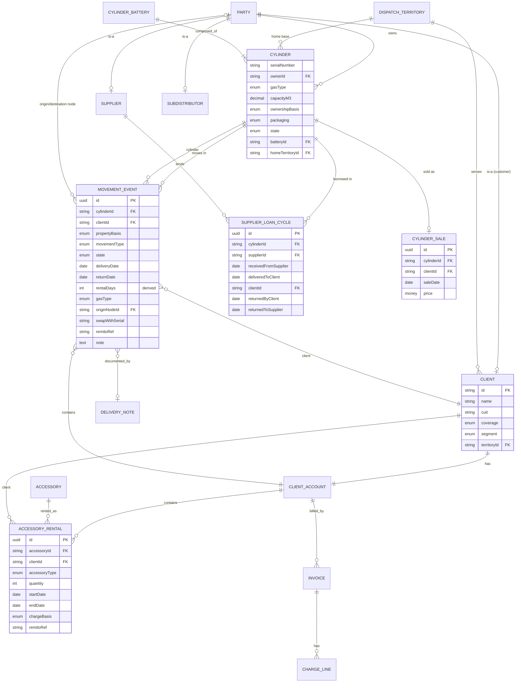
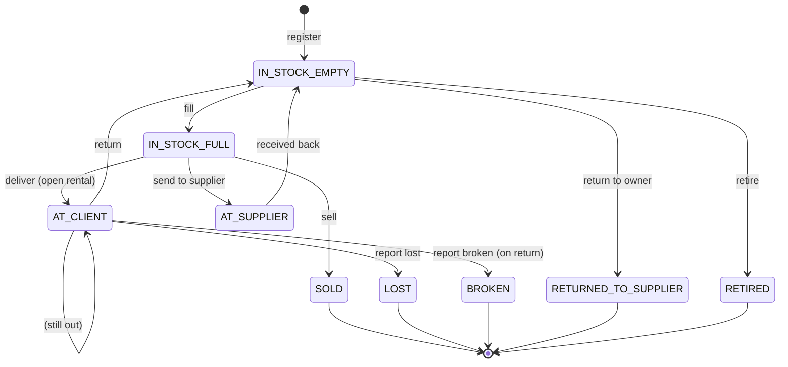
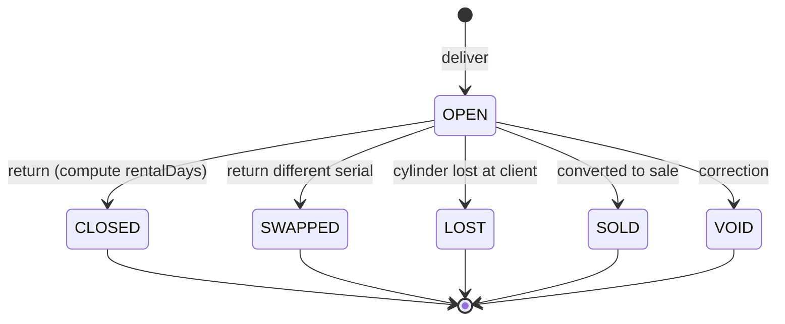
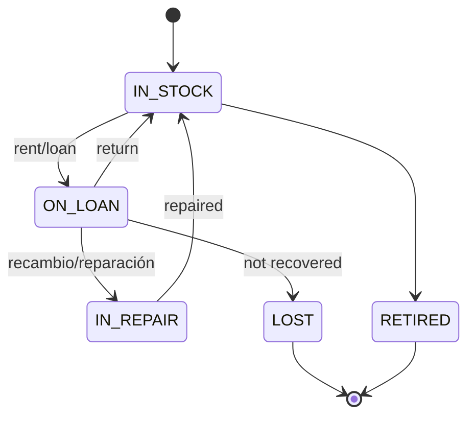
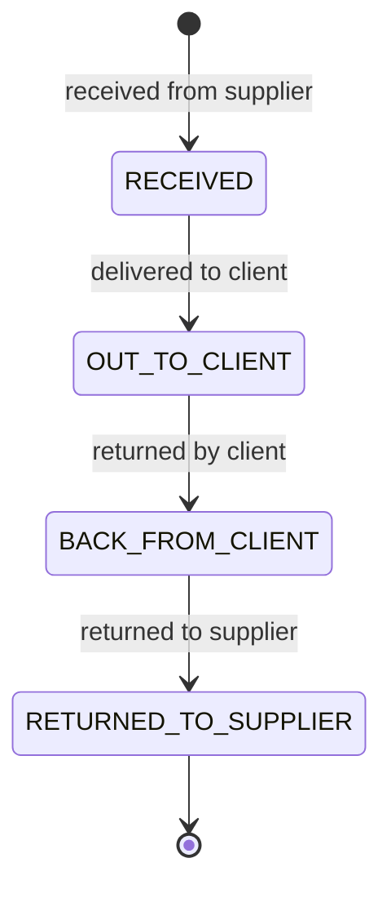
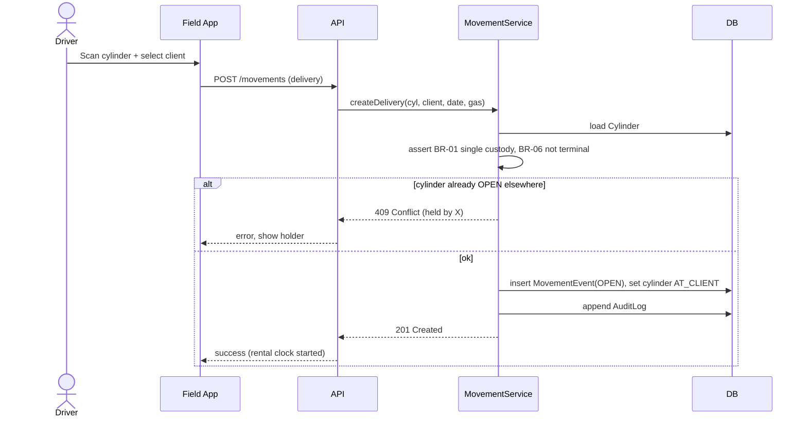
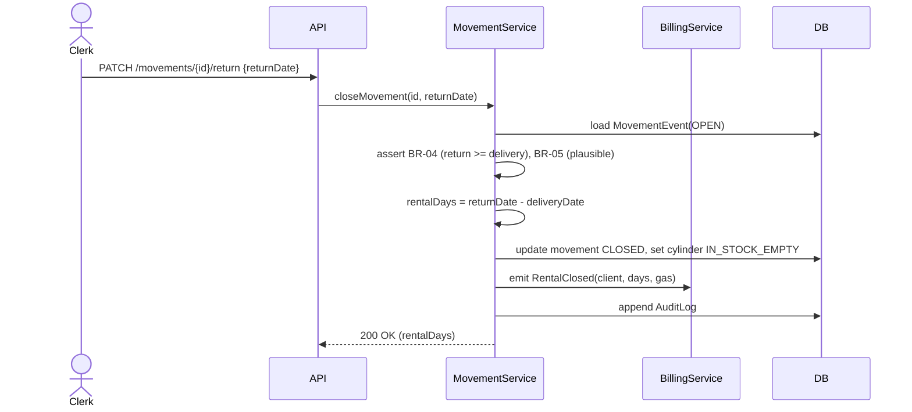
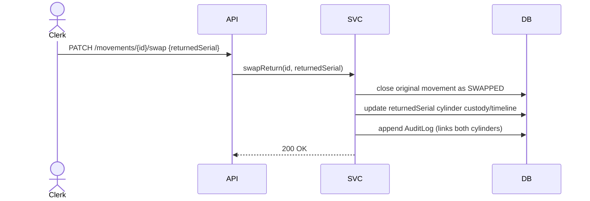
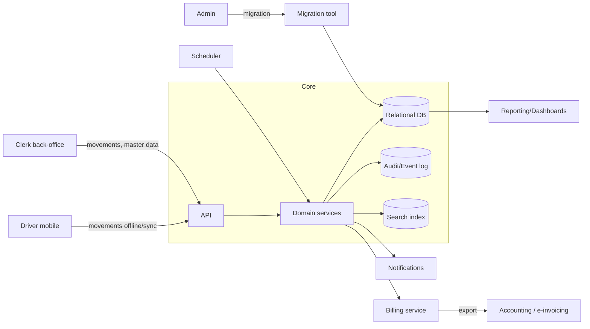

# Software Design Document (SDD)

## Cylinder Custody, Circulation & Rental Management System

**Version:** 1.0 · **Status:** Design for implementation
**Companion documents:** `domain.md` (domain model), `workflows.md` (W1–W20), `product_requirements_document.md` (roles & stories).
**Legend:** `» observed` = grounded in the legacy data; **INFERRED** = design decision/reconstruction.

---

# Executive Summary

The business is a regional Argentine distributor and refiller of **industrial and medical gas cylinders**, currently run on three manual Excel workbooks (~2,140 sheets, ~180,000 movement rows). The legacy system tracks cylinders from two perspectives — **per client** (rental + refill ledgers, two route-books: Junín and Chacabuco) and **per physical cylinder** (circulation history) — plus sales, supplier-loan loops and sub-distributor stock. Its fatal weaknesses are **manual double posting** (the same event typed into two books), **no referential integrity**, **no reporting**, **free-text chaos**, and **formula errors** on the one computed field (rental days).

This SDD specifies a **single system of record** that:

- Records each physical movement **once** as a canonical event, projected into both client- and cylinder-centric views (eliminating dual posting).
- Enforces the domain invariants (**single-custody**, **ownership-basis → rental eligibility**, **date monotonicity**, **terminal-state exclusivity**).
- **Auto-computes rental days** and feeds billing deterministically (no ERROR/blank).
- Provides **real-time float/aging, fleet location, loss and revenue reporting**.
- Supports the **medical home-oxygen** high-frequency flow and municipal billing.
- Runs **offline-capable** field capture for drivers.

Target architecture: a service-oriented backend (REST/JSON + async events), a relational primary store with an append-only audit/event log, a web back-office app, and a mobile field app with offline sync.

---

# Functional Requirements

Each FR traces to a workflow (W1–W20) and PRD story (US-nn).

| ID    | Requirement                                                                                                             | Workflow | Story        |
| ----- | ----------------------------------------------------------------------------------------------------------------------- | -------- | ------------ |
| FR-01 | Create/maintain **Client** with address, locality, CUIT, contacts, territory, coverage, segment, delivery instructions. | W1       | US-01–03     |
| FR-02 | Register/maintain **Cylinder** by (owner, serial), gas, capacity, packaging, ownership.                                 | W2       | US-04, US-06 |
| FR-03 | Register/maintain **Battery** with member cylinders; block independent circulation of members.                          | W2       | US-05        |
| FR-04 | Build & execute **Routes**; mobile capture with **offline sync**.                                                       | W3       | US-07–08     |
| FR-05 | Record **rental delivery** (Nuestra Propiedad); open movement; set cylinder AT_CLIENT.                                  | W4       | US-09–10     |
| FR-06 | Record **return**; **auto-compute rentalDays = returnDate − deliveryDate**; close movement.                             | W5       | US-11        |
| FR-07 | **Accrue rental** only for OURS/SUPPLIER cylinders; continuous accrual while OPEN.                                      | W6       | US-12        |
| FR-08 | Record **customer-owned refill** (Su Propiedad, vacío→lleno); gas charge only, no rental.                               | W7       | US-13        |
| FR-09 | Support **medical O2** high-frequency cycles; replenishment-due alerts; municipal statements.                           | W8       | US-14–15     |
| FR-10 | Record **swap/exchange** (returned serial ≠ delivered serial).                                                          | W9       | US-16        |
| FR-11 | Record **sale**; terminal SOLD; remove from fleet.                                                                      | W10      | US-17        |
| FR-12 | Manage **accessory** rental/loan (regulator/adapter/mochila); recover at closure.                                       | W11      | US-18        |
| FR-13 | Flag **lost/broken**; propose charge-back; supplier-liability alert.                                                    | W12      | US-19        |
| FR-14 | Issue **replacement** cylinder in one event.                                                                            | W13      | US-20        |
| FR-15 | Track **supplier loan loop** (4 stages); enforce ordering; aging.                                                       | W14      | US-21        |
| FR-16 | Record **return-to-owner** (Linde/DSJ/Intergas/customer); pending-return worklist.                                      | W15      | US-22        |
| FR-17 | Record **inter-node transfers**; structured origin node (no text-in-date).                                              | W16      | US-23        |
| FR-18 | **Single-event model**: one post updates both projections.                                                              | W17      | US-24        |
| FR-19 | **Outstanding-cylinder** lists & **physical-count reconciliation**.                                                     | W18      | US-25–26     |
| FR-20 | **Sub-distributor disposition** of node stock.                                                                          | W19      | US-27        |
| FR-21 | **Billing data** generation (rental days × rate + gas + accessories) and export.                                        | W20      | US-28–29     |
| FR-22 | **Reports & dashboards** (fleet, float/aging, loss, revenue, life history).                                             | (gap)    | US-30–31     |
| FR-23 | **Master data** & controlled vocabularies; **rate management**.                                                         | (gap)    | US-32        |
| FR-24 | **Users/roles/permissions**; RBAC.                                                                                      | (gap)    | US-33        |
| FR-25 | **Migration** from workbooks with normalization + exceptions queue.                                                     | (gap)    | US-34        |
| FR-26 | **Global search** across clients, cylinders, movements, accessories.                                                    | (gap)    | —            |
| FR-27 | **Notifications/alerts** (aging, supply-gap, supplier returns, exceptions).                                             | (gap)    | —            |

---

# Non Functional Requirements

| ID     | Category        | Requirement                                                                                                                                                                                                                                                                                         |
| ------ | --------------- | --------------------------------------------------------------------------------------------------------------------------------------------------------------------------------------------------------------------------------------------------------------------------------------------------- |
| NFR-01 | Performance     | Client/cylinder detail loads < 2 s at ≥100k cylinders and ≥200k movements; list queries P95 < 1 s.                                                                                                                                                                                                  |
| NFR-02 | Scalability     | Fleet growth to 500k cylinders and 2M movements without redesign.                                                                                                                                                                                                                                   |
| NFR-03 | Availability    | Back-office 99.5% monthly; field app fully functional **offline**, sync on reconnect.                                                                                                                                                                                                               |
| NFR-04 | Integrity       | DB-enforced constraints + application invariants (single-custody, ownership-basis, monotonic dates, terminal exclusivity, referential integrity).                                                                                                                                                   |
| NFR-05 | Auditability    | Every mutation produces an immutable audit record (who/when/before/after).                                                                                                                                                                                                                          |
| NFR-06 | Security        | RBAC; encrypted transport (TLS) and at-rest; medical patient data access-restricted.                                                                                                                                                                                                                |
| NFR-07 | Localization    | Spanish (AR); dd/mm/yyyy; ARS currency; CUIT validation.                                                                                                                                                                                                                                            |
| NFR-08 | Usability       | Field capture ≤ 3 taps per delivery/return; keyboard-fast back-office entry.                                                                                                                                                                                                                        |
| NFR-09 | Data quality    | Controlled vocabularies; plausibility guards on dates; duplicate detection.                                                                                                                                                                                                                         |
| NFR-10 | Maintainability | Modular services, documented API, seedable reference data.                                                                                                                                                                                                                                          |
| NFR-11 | Recoverability  | Daily backups; point-in-time recovery; migration re-runnable/idempotent.                                                                                                                                                                                                                            |
| NFR-12 | Observability   | Structured logs, metrics, health checks, alerting.                                                                                                                                                                                                                                                  |
| NFR-13 | Quality gates   | Local git hooks + CI MUST pass before commit/push/merge: secrets scan, Prettier, typecheck, tests, and **≥80% global coverage** (lines/branches/functions/statements) on every workspace package. Never skip hooks without an explicit bypass. See `specs/010`, `specs/012`, `docs/DEVELOPMENT.md`. |

---

# Actors

**Human actors**

- **Administrative Clerk** — primary back-office operator. `» observed`
- **Delivery Driver (Repartidor)** — mobile field capture. `» observed`
- **Plant / Filling Operator** — empty/full stock, filling, damage. **INFERRED**
- **Inventory / Warehouse Controller** — reconciliation, audits, transfers. `» observed`
- **Billing / Accounts Clerk** — rental/gas/accessory charges, export. **INFERRED**
- **Business Owner / Manager** — dashboards, KPIs. **INFERRED**
- **Sub-Distributor / Agent** — node stock (Ceres, Pantiga, Ezequiel, Tito, Buroni). `» observed`
- **System Administrator** — users, config, migration.
- **Municipal Hospital Coordinator** — validates medical consumption. `» observed`
- **Client** (Phase-2 self-service). **INFERRED**

**System actors**

- **Scheduler** — nightly accrual snapshots, aging recomputation, alert generation.
- **Accounting/e-Invoicing system** (external) — receives billing exports.
- **Notification gateway** (email/SMS/push).

---

# User Roles

| Role                    | Key capabilities                                                        | Denied                              |
| ----------------------- | ----------------------------------------------------------------------- | ----------------------------------- |
| R1 Clerk                | CRUD clients; post all movement types; accessories; swaps.              | Rate mgmt, user mgmt.               |
| R2 Driver               | Field deliveries/returns/pickups/swaps; view stops.                     | Sales, sale price, rates, deletes.  |
| R3 Plant Op             | Fill; set empty/full; register cylinders/batteries; mark broken.        | Client billing.                     |
| R4 Inventory Controller | Reconciliation, audits, transfers, loss/return worklists, life history. | Rates, user mgmt.                   |
| R5 Billing Clerk        | Generate/approve/export billing; manage client rates.                   | Movement posting edits (read-only). |
| R6 Manager              | All read + dashboards; approve write-offs.                              | Bulk deletes.                       |
| R7 Sub-Distributor      | Node stock, dispositions, transfers for own node.                       | Other nodes, billing.               |
| R8 Admin                | Users, roles, reference data, migration, config.                        | (segregation) not billing approval. |
| R9 Hospital Coordinator | Read medical patients; approve/dispute municipal lines.                 | General fleet.                      |
| R10 Client (P2)         | View own held cylinders; request delivery.                              | Everything else.                    |

RBAC is enforced centrally; each action checks `role → capability`. Sensitive actions (sale, loss write-off, rate change, delete) require elevated roles and are audited.

---

# Business Rules

Numbered, testable rules (BR). Derived from `» observed` data and the domain model.

- **BR-01 Single custody.** A cylinder (or battery) has **at most one OPEN movement** at any instant; a new delivery is blocked while it is AT_CLIENT/AT_SUPPLIER. `» observed` (implicit; violated in legacy)
- **BR-02 Ownership ⇒ rental eligibility.** Rental accrues **only** when `propertyBasis ∈ {OURS, SUPPLIER}`. Customer-owned refills accrue **no rental**. `» observed` (right pane METROS blank)
- **BR-03 Rental days.** `rentalDays = returnDate − deliveryDate` (calendar days), computed by the system; while OPEN, **accrued days = today − deliveryDate**. `» observed` (verified 373/373 in TORRES; header renamed "ALQUILER" in LABORDE)
- **BR-04 Date monotonicity.** For any movement `deliveryDate ≤ returnDate`; for supplier loops the four dates are non-decreasing. `» observed`
- **BR-05 Plausible dates.** Dates outside `[2000-01-01, today + 30d]` are rejected/confirmed (legacy had 2047/2048 typos). `» observed`
- **BR-06 Terminal exclusivity.** After `SOLD | LOST | BROKEN | RETURNED_TO_SUPPLIER | RETIRED`, no new rental movement may be created. `» observed`
- **BR-07 Gas match.** Movement gas should equal the cylinder's current gas; a mismatch requires confirmation (re-purposing) and updates the cylinder's gas. `» observed` (cylinder gas can change over life)
- **BR-08 Refill has no rental, delivery of ours has rental.** Enforced by pane/propertyBasis. `» observed`
- **BR-09 Sale precondition.** A cylinder with an OPEN rental cannot be sold; the rental must be closed first. `» observed` (integrity)
- **BR-10 Accessory recovery.** A client account cannot be closed while it holds an accessory ON_LOAN. `» observed` (regulador/mochila loans)
- **BR-11 Supplier asset return.** Supplier-owned cylinders must eventually reach `RETURNED_TO_SUPPLIER`; open loops age onto a worklist. `» observed` (Nordelta 4-date loop)
- **BR-12 Loss liability routing.** Loss of a supplier cylinder (`IG`) raises a supplier-liability alert; loss of ours proposes a client charge-back. `» observed` (PERDIDO IG)
- **BR-13 Battery integrity.** A member serial cannot circulate independently or belong to two active batteries. `» observed` (bat sheets)
- **BR-14 Structured origin.** Transfers use a structured **origin node/party**, never free text in a date field (legacy "buroni" caused ERROR). `» observed`
- **BR-15 Controlled vocabularies.** `gasType`, `state`, `accessoryType`, `coverage`, `locality` must map to enumerations; legacy variants normalized. `» observed`
- **BR-16 Single-event posting.** One movement post updates both client and cylinder projections; the two can never diverge. `» observed` (fixes dual posting)
- **BR-17 CUIT validity.** If present, CUIT must pass mod-11 check. `» observed`
- **BR-18 Medical coverage billing.** `MUNICIPAL_HOSPITAL` clients route to the municipal billing profile. `» observed` (HOSP.MUNIC.)
- **BR-19 Rate application.** Rental charge = accrued days × the client's effective daily rate (or configured monthly rate). `» observed` ($85/día; ALQ $333,33)
- **BR-20 Outstanding = open.** A movement with no return date means the cylinder is **still at the client** (float). `» observed`

---

# Domain Model

Full model in `domain.md`. Core entities and aggregates:

- **Aggregate: Cylinder** (root) — `serialNumber`, `gasType`, `capacity`, `ownershipBasis`, `owner`, `packaging`, state; contains **CirculationEntry** (asset-view projection) and **SupplierLoanCycle**.
- **Aggregate: CylinderBattery** (root) — composes member Cylinders.
- **Aggregate: Client** (root) — master data; contains **ClientAccount** → **CylinderMovement** (rental/refill) and **AccessoryRental**.
- **Aggregate: Accessory** (root) — devices; contains **AccessoryRental**.
- **Aggregate: CylinderSale** (root) — terminal ownership transfer.
- **Aggregate: Party** (root) — Us / Supplier / SubDistributor / Customer.
- **Aggregate: DispatchTerritory** (root) — routes/localities.
- **Reference/support:** DeliveryNote (Remito), Invoice/RentalCharge (external context).

**Value objects:** CylinderSerialNumber, Capacity(m³), RentalPeriod(days), CUIT, Address, Locality, Contact, Money(ARS), OwnershipTag, DeliveryInstruction, DateStamp.

**Key enumerations:** GasType, OwnershipBasis(OURS/CUSTOMER/SUPPLIER), CylinderState, CylinderCondition, CylinderPackaging, MovementType, MovementState, AccessoryType, AccessoryState, ClientCoverage, ClientSegment, PartyType, DispatchTerritory.

> **Central design decision:** `CylinderMovement` and `CirculationEntry` in the legacy books are the **same event** duplicated by hand. Here they are **one persisted MovementEvent** with two read projections — the single most important structural fix.

---

# ER Diagram (Mermaid)



---

# State Diagrams

### Cylinder lifecycle



### Movement (rental) lifecycle



### Accessory rental lifecycle



### Supplier loan cycle



---

# Sequence Diagrams

### Deliver a rental cylinder (W4)



### Return cylinder & compute rental days (W5/W6)



### Swap on return (W9)



### Monthly billing (W20)

```mermaid
sequenceDiagram
    actor Biller
    participant API
    participant Bill as BillingService
    participant DB
    participant Ext as Accounting
    Biller->>API: POST /billing/run {period, clientId?}
    API->>Bill: computeCharges(period)
    Bill->>DB: query movements (closed + open-accrued), refills, accessories
    Bill->>Bill: rental = days x rate (BR-19); gas + accessory lines
    Bill-->>API: draft charges
    Biller->>API: POST /billing/approve
    API->>Ext: export approved charge lines
    Ext-->>API: ack
```

---

# Data Flow

**Level-0 (context).** Drivers and Clerks submit movements → **Core System** (single MovementEvent store) → projections feed Billing export → Accounting; alerts feed Notification gateway; dashboards feed Manager.



**Key flows**

1. **Movement capture:** field/back-office → validation (BR-01..07) → persist MovementEvent → update Cylinder state → append audit → index for search.
2. **Accrual snapshot (nightly):** scheduler recomputes open-rental accrued days and aging buckets.
3. **Billing:** period query → charge computation → approval → export.
4. **Alerts:** aging/supply-gap/supplier-return/exception detection → notifications.
5. **Migration:** workbook parse → normalize → merge dual books → clean vs exceptions queue.

---

# API Requirements

RESTful JSON over HTTPS; resource-oriented; idempotent writes where possible (client-supplied request IDs for offline sync). Representative endpoints (contract-level, no code):

**Clients**

- `POST /clients`, `GET /clients/{id}`, `PATCH /clients/{id}`, `GET /clients?search=&territory=&coverage=`
- `GET /clients/{id}/account` (movements, outstanding, accessories)

**Cylinders**

- `POST /cylinders`, `GET /cylinders/{ownerId}/{serial}`, `PATCH /cylinders/...`
- `GET /cylinders/{id}/history` (circulation projection)
- `POST /batteries`, `GET /batteries/{id}`

**Movements (single event)**

- `POST /movements` (delivery or refill-in) — body includes `propertyBasis`, cylinder, client, date, gas, optional remito/origin node
- `PATCH /movements/{id}/return` — `returnDate` → computes rentalDays
- `PATCH /movements/{id}/swap` — `returnedSerial`
- `PATCH /movements/{id}/void` — correction (audited)
- `GET /movements?client=&cylinder=&state=&from=&to=`

**Sales / Loss / Replacement**

- `POST /sales`, `POST /cylinders/{id}/loss`, `POST /cylinders/{id}/replace`

**Accessories**

- `POST /accessory-rentals`, `PATCH /accessory-rentals/{id}/return`

**Supplier loops / transfers**

- `POST /supplier-loans`, `PATCH /supplier-loans/{id}/{stage}`
- `POST /transfers` (node → node/client)

**Billing / Reports / Search**

- `POST /billing/run`, `POST /billing/approve`, `GET /billing/export`
- `GET /reports/{fleet|float|aging|loss|revenue|life-history}`
- `GET /search?q=` (federated)

**Admin / Migration**

- `POST /admin/reference-data`, `POST /admin/rates`, `POST /admin/users`
- `POST /migration/import`, `GET /migration/exceptions`

**Conventions:** cursor pagination; standard error envelope (`code`, `message`, `details`); `409` for invariant conflicts (e.g., single-custody); optimistic concurrency via ETag/version; async endpoints return job handles.

---

# Authentication

- **Mechanism:** token-based (OIDC/OAuth2 authorization-code for web; device-bound credentials + refresh tokens for the mobile field app). **INFERRED**
- **Sessions:** short-lived access tokens, longer refresh tokens; revocation list for lost devices.
- **Offline field app:** authenticates once, caches a signed session allowing offline capture; queued writes are re-authenticated at sync; server rejects stale/expired queues.
- **Password policy / MFA:** MFA required for R5 Billing, R6 Manager, R8 Admin (privileged roles).
- **Service-to-service:** signed service tokens for Billing↔Accounting and Scheduler.

---

# Authorization

- **Model:** Role-Based Access Control (R1–R10) with capability checks per endpoint; optional **territory scoping** (a driver/sub-distributor sees only their route/node).
- **Segregation of duties:** movement posting (R1/R2) separated from rate/billing approval (R5) and user/config admin (R8).
- **Sensitive operations** (sale, loss write-off, void, rate change, delete, migration) require elevated roles and produce mandatory audit reasons.
- **Medical data** (R9 patient info) is access-restricted; only medical-authorized roles can view patient identity/consumption.
- **Enforcement point:** central authorization middleware; deny-by-default; every decision logged.

---

# Audit Trail

- **Append-only** audit log for every create/update/delete/void: `actor`, `role`, `timestamp`, `entity`, `entityId`, `action`, `before`, `after`, `requestId`, `source (web/mobile/migration/scheduler)`.
- **Immutable:** no updates/deletes on audit records; tamper-evident (hash chaining optional).
- **Business-event log (event sourcing-friendly):** MovementCreated, MovementClosed, CylinderSold, CylinderLost, ReplacementIssued, AccessoryRented/Returned, SupplierLoanStageAdvanced — enabling reconstruction and reporting.
- **Retention:** legal minimum for fiscal records (multi-year); exportable for audits.
- **Corrections** are new events (`VOID` + re-post), never silent edits — directly fixes the legacy "overwrite in place" problem.

---

# Search

- **Global federated search** across Clients (name, CUIT, phone, locality), Cylinders (serial across owners, gas, state, current holder), Movements (by date range, remito), Accessories.
- **Serial search must disambiguate** duplicate serials across owners (return all `(owner, serial)` matches). `» observed` need
- **Fuzzy client search** to surface near-duplicate names (mitigates legacy spelling drift). `» observed`
- **Filters/facets:** territory, coverage, gas, state, ownership, aging bucket, open/closed.
- **Backing:** search index (e.g., inverted index service) kept in sync via domain events; typo-tolerant matching.

---

# Reports

Closes the biggest legacy gap (no reports existed). Core reports:

1. **Fleet inventory** — cylinders by state / gas / owner / territory; total owned vs supplier vs customer.
2. **Float & aging** — cylinders currently AT_CLIENT, grouped by client/territory, buckets >30/>90/>180/>365 days. `» observed` need (blank-return = out)
3. **Outstanding per client** — open movements + accrued rental days (billing preview).
4. **Rental report** — rental days and revenue by client/gas/territory/period.
5. **Gas volume report** — deliveries/refills by gas and period.
6. **Loss & breakage** — lost/broken by owner (supplier-liability vs client charge-back). `» observed`
7. **Supplier assets to return** — open loan loops aging (Nordelta/Intergas). `» observed`
8. **Pending owner returns** — "must return" worklist (Linde/DSJ/Buroni). `» observed`
9. **Cylinder life history** — full circulation of a serial across years/clients. `» observed`
10. **Medical/municipal statement** — per-patient O2 + accessory consumption for municipal billing. `» observed`
11. **Sales report** — cylinders sold, value, period.
12. **Data-quality/exceptions** — to-verify serials, mismatches, out-of-range dates.

All reports: filterable, exportable (CSV/PDF), and dashboard-summarized for R6.

---

# Inventory

- **Two synchronized views from one store:** client-centric (account) and cylinder-centric (history) — both projections of `MovementEvent`.
- **State-derived stock:** counts computed from cylinder state (no manual tallies).
- **Batteries** counted as a unit and as members; members not independently loanable (BR-13).
- **Ownership pool:** OURS / SUPPLIER(named)/ CUSTOMER — inventory valuation and liability segregate by owner. `» observed`
- **Nodes:** each sub-distributor/territory holds sub-stock; transfers move quantities between nodes (BR-14).
- **Reconciliation:** physical count import → variance report → actions (loss/transfer/correction) (W18).
- **Empties vs fulls:** condition tracked (`IN_STOCK_EMPTY` / `IN_STOCK_FULL`) to drive filling and route loads.

---

# Rental Logic

- **Eligibility (BR-02):** only OURS/SUPPLIER cylinders accrue rental; CUSTOMER refills never do.
- **Duration (BR-03):** `rentalDays = returnDate − deliveryDate`; **open rentals accrue to `today`**. This is the single computed value; the system guarantees it is always numeric (no ERROR, unlike legacy 429/352 error cells). `» observed`
- **Rate (BR-19):** per-client effective rate, daily (e.g., 85) or monthly (e.g., prorated 333.33/day); default rate by gas/segment if none set. Rate history preserved for back-dated billing. `» observed`
- **Charge:** `rentalCharge = accruedDays × rate` per movement; aggregated per client per period.
- **Special cases:** laser-O2 flagged for rental (`COBRAR ALQUILER OXIGENO LASER`); accessory rentals billed in parallel (regulator/mochila). `» observed`
- **Stop conditions:** rental stops at CLOSED/SWAPPED/SOLD/LOST; sale converts remaining liability appropriately (BR-09).
- **Grace/rounding rules:** configurable (min days, same-day handling) — **INFERRED**, to confirm with business.

---

# Cylinder Tracking

- **Identity:** `(owner, serialNumber)` — resolves legacy cross-owner serial collisions (Linde 309817 vs own 309817). `» observed`
- **Custody:** always exactly one holder while OPEN (BR-01); every movement changes and records custody with dates.
- **Life history:** every out/in with holder, dates, gas — reconstructable from events (legacy sheet `14` had 1,557 rows spanning 2004–2026). `» observed`
- **Ownership & branding:** structured owner field replaces inline tags (`linde`, `(intergas)`, `propio`). `» observed`
- **Batteries:** tracked as a unit with member registry (`11002 bat` → 8 serials). `» observed`
- **Supplier loops:** four-stage tracking (Nordelta/Intergas). `» observed`
- **Terminal states:** SOLD/LOST/BROKEN/RETURNED/RETIRED remove from active fleet.

---

# Notifications

Event-driven alerts (channels: in-app, email, SMS/push):

- **Long-outstanding cylinder** (>90 days OPEN) → Inventory Controller. `» observed` need
- **Medical supply-gap due** → Driver/Clerk (patient replenishment). `» observed`
- **Supplier asset overdue** (open loop >120 days) → Clerk. `» observed`
- **Pending owner return** unactioned (>30 days) → Inventory Controller. `» observed`
- **Single-custody conflict** on sync → Clerk (field/back-office collision).
- **Loss recorded** → Manager + supplier-liability alert if IG. `» observed`
- **Accessory not recovered** on account closure attempt → Clerk. `» observed`
- **Migration/exception queue** items → Admin.
- **Billing period ready / export failed** → Billing Clerk.

Each notification links directly to the relevant worklist item.

---

# Validation Rules

Field- and rule-level validations (enforced client + server):

- **Client:** name required; CUIT (if present) mod-11 valid (BR-17); locality/territory from enum; phone format `0XXXX-XXXXXX`.
- **Cylinder:** serial required, unique per owner (BR-02 identity); gas from GasType enum (BR-15); capacity from allowed sizes; owner required if SUPPLIER.
- **Movement:** cylinder + client + deliveryDate required; `returnDate ≥ deliveryDate` (BR-04); dates plausible (BR-05); gas from enum; propertyBasis consistent with cylinder ownership (BR-08); origin must be a structured node, never text-in-date (BR-14).
- **Sale:** no OPEN rental on the cylinder (BR-09); price ≥ 0.
- **Accessory rental:** quantity ≥ 1; endDate ≥ startDate; type from enum.
- **Supplier loop:** four dates non-decreasing (BR-04/BR-11).
- **Battery:** ≥2 members; no member in another active battery (BR-13).
- **Global:** controlled vocabularies everywhere; duplicate-client detection warning; optimistic concurrency version required on updates.

---

# Edge Cases

Grounded in real legacy anomalies:

- **Same serial, different owners** → keyed by `(owner, serial)`; search returns all. `» observed`
- **Multiple cylinders in one cell** (`6035 -169432 -192072`) → split into linked movements or a battery on import. `» observed`
- **Swap: returned serial ≠ delivered** (`241846(5567)`) → SWAPPED with linkage (W9). `» observed`
- **Origin is a node, not a date** (`buroni` in delivery column) → structured origin; no ERROR. `» observed`
- **Blank return for years** → remains OPEN, surfaces in aging; does not silently vanish. `» observed`
- **Impossible dates (2047/2048)** → rejected/flagged (BR-05). `» observed`
- **Cylinder appears at two clients** (legacy could) → single-custody blocks; conflict on sync → resolution worklist. `» observed`
- **Ownership misclassification** (`devuelto ... por ser de s/p`) → mismatch flag & correction. `» observed`
- **Regulator repair/replacement** (`recambio regulador reparación`) → accessory IN_REPAIR path. `» observed`
- **Duplicate/near-duplicate client names** across route-books → dedup/merge tooling. `» observed`
- **Supplier cylinder lost while on loan** (`PERDIDO IG`) → supplier liability, not client charge. `» observed`
- **Same-day deliver+return** (medical) → rentalDays = 0 or min-day rule (configurable). `» observed`
- **Sold-but-still-listed** (legacy) → sale removes from fleet; blocks new rentals (BR-06).

---

# Error Handling

- **Validation errors:** `422` with field-level details; client shows inline messages; nothing persisted.
- **Invariant conflicts:** `409` (e.g., single-custody, sale-with-open-rental) with the conflicting entity referenced for resolution.
- **Concurrency:** optimistic version mismatch → `409`, prompt reload/merge.
- **Offline sync conflicts:** server accepts non-conflicting queued writes, quarantines conflicts to a driver/clerk resolution queue (never silent overwrite).
- **Idempotency:** client request IDs prevent duplicate movements on retry.
- **Partial failures (batch/battery):** atomic per logical operation; all-or-nothing with clear rollback.
- **External export failures (Accounting):** retriable job with backoff; alert on repeated failure; billing stays in "approved, not exported" state until confirmed.
- **Migration errors:** row-level isolation → exceptions queue, never abort the whole import; full migration report.
- **Observability:** every error carries a correlation/requestId linking API log ↔ audit ↔ notification.

---

# Future Improvements

1. **Hydrostatic re-certification tracking** — the legacy data has **no** cylinder re-test/expiry field; add certification dates, due-date alerts, and block delivery of overdue cylinders (safety + regulatory). `» observed` gap — high priority.
2. **Resolve `PH` gas prefix** semantics with the business and fold into GasType. `» observed`
3. **Barcode/RFID scanning & telematics** for near-zero-effort field capture and GPS route optimization.
4. **Full accounting/e-invoicing (AFIP) integration** rather than export-only.
5. **Client & municipal self-service portals** (Phase 2, R9/R10).
6. **Demand forecasting** for medical replenishment and stock rebalancing across nodes.
7. **Predictive loss/aging analytics** (which clients/cylinders trend to non-return).
8. **Consignment/comodato contract module** (formalize rental agreements, deposits).
9. **Weight-based consumption capture** at the weighbridge (`PASAR POR BALANZA`) for gas billing accuracy. `» observed`
10. **Event-sourced read models** for instant, flexible reporting at scale.
